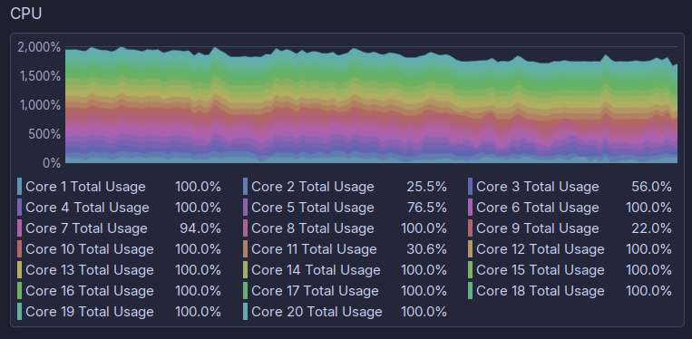
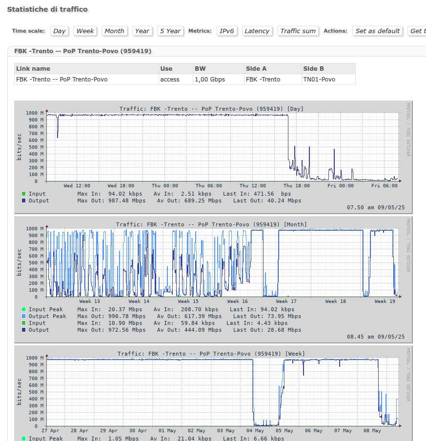
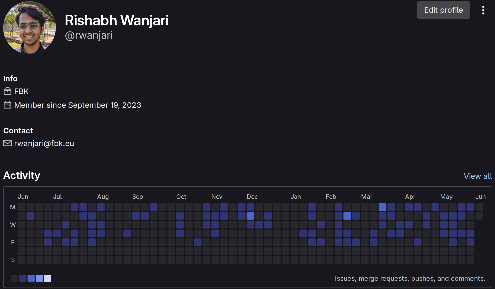
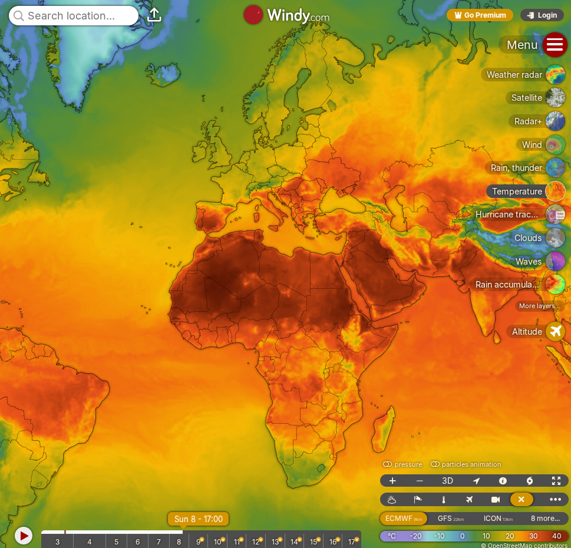
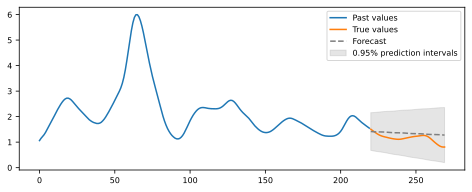
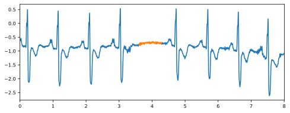
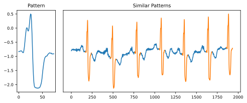
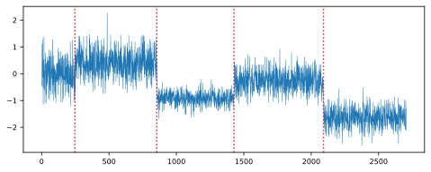
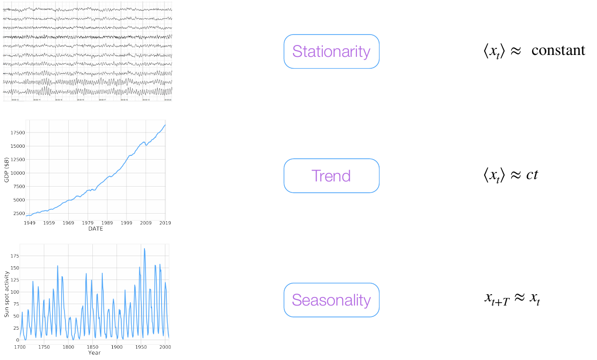
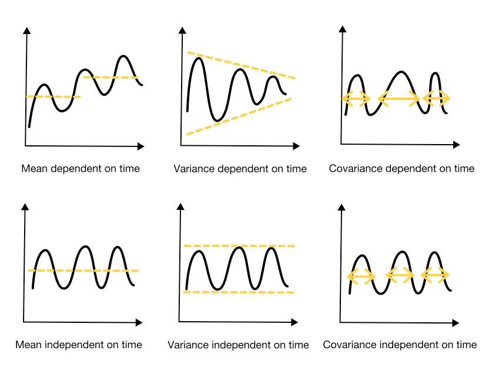

# Time Series Forecasting

### Rishabh Wanjari

##### 20/06/2025

<!--
Before we begin, some **please** tell me they recognize this background so I feel validated.

Welcome to your introduction to time series forecasting! I'm going to be filling in for a collegue, as this isn't my area of expertise, but hopefully I can cover enough of the basics.

Let's start by talking about what a time series is, or rather, what it can be.
-->

---
transition: slide-up
---

# What is a time series?

###### KDE System Monitor

<!--
Is this rainbow coloured atrocity a time series?
The x-axis isn't labelled, but it is. As the title says, it depicts CPU usage. While we're looking at the axes, what does it mean to use two thousand percent of your CPU? Is this a good representation of the data, or is there a better way? I will let you decide that.
-->

---
layout: center
transition: slide-left
---

<tabler-arrow-left class="text-3xl text-red-400 mx-2 absolute top-31.5 left-146" />
<tabler-arrow-left class="text-3xl text-red-400 mx-2 absolute top-65.5 left-147" />
<tabler-arrow-left class="text-3xl text-red-400 mx-2 absolute top-103.5 left-146.5" />

###### FBK Internet Usage

<!--
This is a much more useful graph. Here, the axes are clearly labelled. The only thing that changes between the three graphs is the scale used, as shown in the titles here. (click)
What do they depict? They show FBKs internet usage over a certain period. Why this particular time frame? Because *someone* was wrecking havoc on our internet and causing issues for everyone. Don't ask me how I know.
-->

---
layout: default
src: ./pages/docker_logs.md
transition: slide-up
---

---
transition: slide-right
---

###### FBK Gitlab Instance Stats

<!--
This is my contributions graph on GitLab, which we use at FBK to manage our code and projects. You can find the same thing on other people's GitHub profiles. This, is also a time series. But instead of being a line on a graph, it is represented as a calendar heatmap. Here, the intensity of the color corresponds to the number of contributions made on that day.
You can clearly see the periods of the year when I went on holiday.
But why would someone choose to represent data like this instead of plotting it as a graph normally?
Also put a link to https://github-painter.vercel.app maybe.
-->

---

###### Windy.com

<!--
Finally, as the main topic for this school is weather, let's take a look at weather time series data. In this case, we're looking at surface level temperature across the globe. There's a time slider, so you can see how it changes. But this time, the data is an image. Makes sense, as that's the most logical way to present it.
-->

---
layout: center
transition: slide-left
---

## What can you do?

Forecasting

Anomaly detection

https://siebert-julien.github.io/time-series-analysis-python/

<!--
Now that you know what a time series is, what can you do with them? We're mainly going to focus on forecasting, that is, predicting what's going to happen in the future given past data. You can also do anomaly detection, which is trying to figure out when a part of a series doesn't fit in with the rest. This could be useful, for example, for removing outliers from your dataset.

-->

---
layout: center
---

## What else can you do?

Pattern detection

Change point detection

https://siebert-julien.github.io/time-series-analysis-python/

<!--
You can also do other stuff, like detecting patterns. If we go back to my calendar heatmap, you could easily tell that I only worked during the weekdays, and never during the weekend. That's a consistent pattern. There's also change point detection, where the properties of the time series change abruptly. Continuing with the heatmap, you can tell when I go on holiday because my activity suddenly drops to zero, then resumes again when I'm back.
-->

---

## Fundamental behaviours

 

https://github.com/DataForScience/Timeseries

<!--
I couldn't do it any better, so I stole this slide. This shows three ways a time series can behave. The angled bracket here just means the average. Of course, the way you classify the series depends on the time scale you look at. For example, on a small enough scale, a seasonal series may look like it has a trend of going either up or down.
-->

---

## Stationarity
The first step of any analysis is to transform the series to make it stationary.

https://wandb.ai/iamleonie/A-Gentle-Introduction-to-Time-Series-Analysis-Forecasting/reports/A-gentle-introduction-to-time-series-analysis-forecasting--VmlldzoxMDg5NDMxMw

<!--
The most important of the three is stationarity. A lot of models assume that a series is stationary. When the future is similar to the past, it is easier to forecast. If a series isn't stationary, you can always transform it until it is. So, with that, let's move to the Jupyter notebook and see how we can do this irl.
-->

---
layout: center
class: text-center
---

# Learn More

[Documentation](https://sli.dev) · [GitHub](https://github.com/slidevjs/slidev)

<PoweredBySlidev mt-10 />
